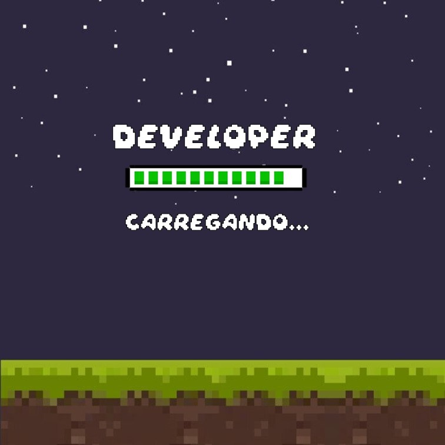

# Caio Eduardo

## Meu nome é Caio Ireno, tenho 24 anos e moro em sorocaba com minha esposa e três gatinhas :couple::smiley_cat::smiley_cat::smiley_cat:

## Sou graduado em engenharia mecatrônica e estou começando a estudar programação com foco em desenvolvimento WEB. Durante minha graduação, desenvolvi alguns programas em JavaScrpit, C++ e Python. Também desenvolvi algumas páginas web usando HTML5 e CSS3.

## Atualmente desenvolvo pequenos projetos utilizando HTML, CSS e JavaScript. Além disso faço o uso de UX e UI Design nos projetos WEB.
